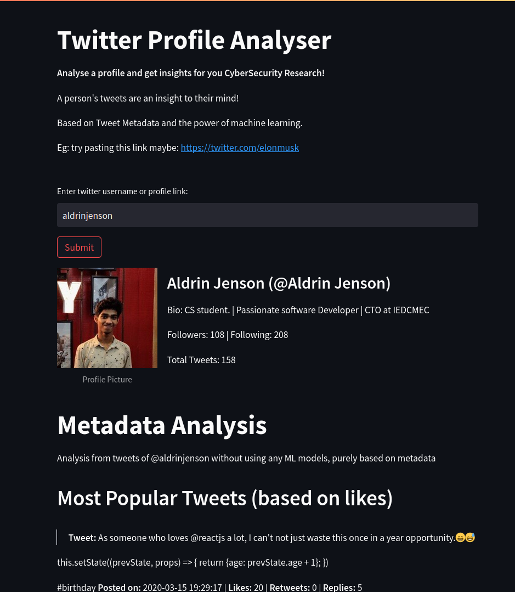
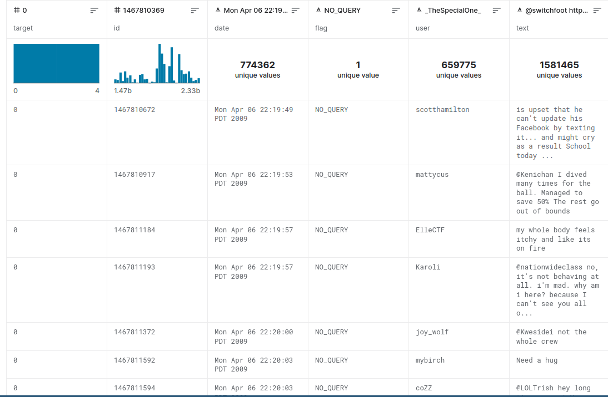
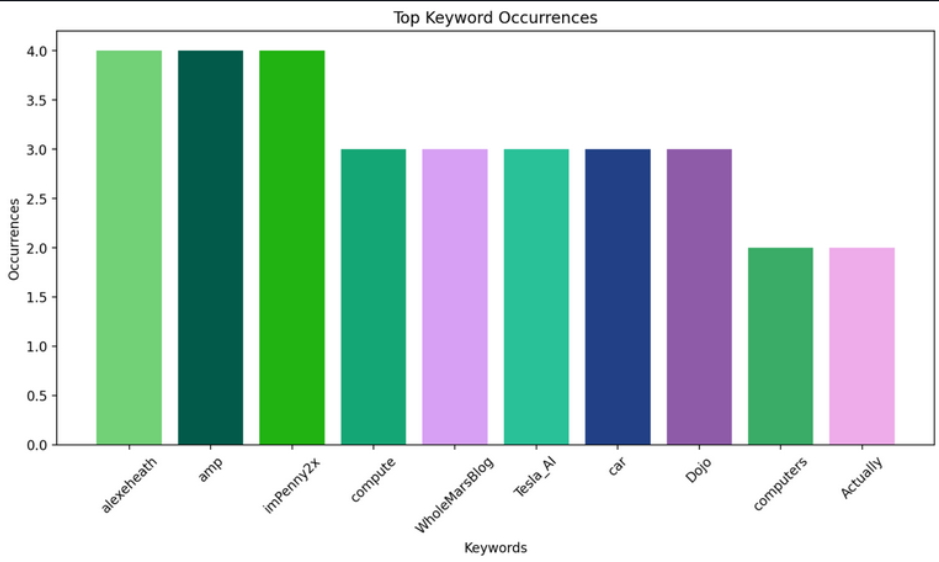

# Twitter Sentiment and Metadata Analysis

Web application built with Streamlit and Python for sentiment and metadata analysis of Twitter profiles. The app allows users to input a Twitter profile URL or username and performs various analysis on the latest 100 tweets. Both metadata based and ML/DL algorithms based analysis is done.

## Features

- Perform sentiment analysis on Twitter data based on custom created model. (Model trained on sentiment140 twitter dataset of 1,600,000 tweets)
- Analyze emotions expressed in tweets using pre-trained models.
- Process and visualize metadata from Twitter profiles using charts and graphs.
- Identify and analyze proper and common nouns in tweets using NLTK models.
- Minimalist and beautiful Web application
- Provide a summary of top tweets based on likes.
- Display user profile information and bio.
- Easy input of Twitter profile URL or username.
- Efficient scraping of the latest 100 tweets using snscrape.
- Integration with popular machine learning libraries such as scikit-learn.
- Support for multiple models and datasets for sentiment and emotion analysis.
- Made in modular and Object Oriented manner - Easily extensible for adding further models

## Installation

1. Clone the repository:

```bash
git clone https://github.com/your-username/twitter-analysis-app.git
```

2. Navigate to the project directory:

```bash
cd twitter-analysis-app
```

3. Install the required dependencies:

```bash
pip install -r requirements.txt
```

## Usage

Run the Streamlit app:

```bash
streamlit run app.py
```

- Open your web browser and go to the provided local URL (usually http://localhost:8501).
- Enter a Twitter profile URL or username in the input field.
- Click the "Analyze" button to start the analysis process.
- Explore the sentiment analysis, emotion analysis, metadata report, and noun processor results in the app's interface.
- Export any analysis results or reports as needed.

## Contributing

Contributions are welcome! If you have any ideas, improvements, or bug fixes, please open an issue or submit a pull request.

## License

This project is licensed under the MIT License.

## References

- [Sentiment140 dataset with 1.6 million tweets](https://www.kaggle.com/datasets/kazanova/sentiment140)
- [bhadresh-savani/distilbert-base-uncased-emotion](https://huggingface.co/bhadresh-savani/distilbert-base-uncased-emotion)

## Acknowledgments

Special thanks to the contributors and developers of the open-source libraries and frameworks used in this project.

## Screenshots

Here are some screenshots of the app:

- Complete UI: 
- Confusion Matrix: 
- Dataset Contents Bar Chart: 
- Dataset Head: 
- Dataset Previsualization: 
- Emotion Pie Chart: 
- Initial UI: 
- Metadata: 
- Initial Metadata: 
- Model Result: 
- Nouns Bar Chart: 
- Nouns Word Cloud: 
- Sentiment Analysis: 
